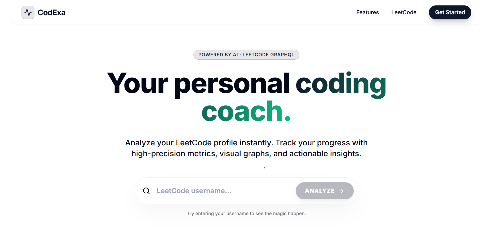
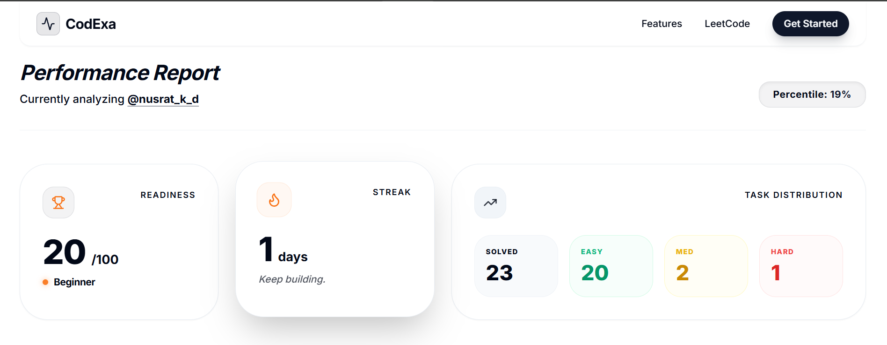
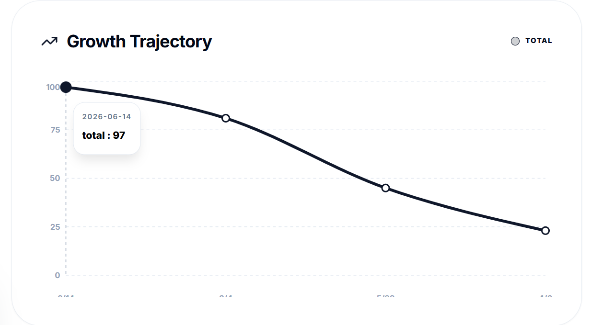
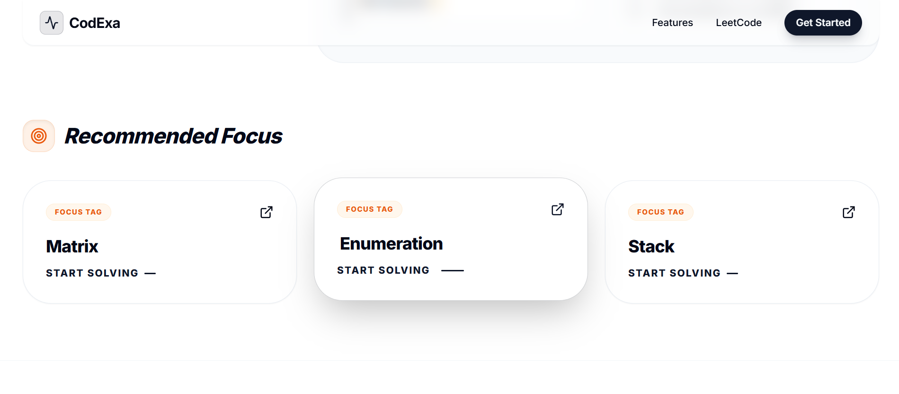

# CodeXa - Competitive Programming Analytics Platform

CodeXa is a full-stack web application that analyzes LeetCode profiles and provides personalized insights to help users improve their problem-solving skills and interview readiness.

## Features

* Analyze any public LeetCode profile
* Historical progress tracking using MongoDB
* Easy, Medium, Hard problem breakdown
* Weak topic detection
* Personalized problem recommendations
* Placement readiness score
* Daily study plan generation
* Consistency streak tracking
* Benchmark comparison against interview preparation targets
* Interactive analytics dashboard

## Tech Stack

### Frontend

* React.js
* Tailwind CSS
* Framer Motion
* Recharts
* Axios

### Backend

* Node.js
* Express.js
* MongoDB
* Mongoose

## How It Works

1. User enters a LeetCode username.
2. Backend fetches profile data from LeetCode GraphQL APIs.
3. Statistics are processed and analyzed.
4. Historical progress is stored in MongoDB.
5. Personalized insights and recommendations are generated.
6. Results are displayed through an interactive dashboard.

## Project Structure

backend/

* models/
* routes/
* server.js

frontend/

* src/
* public/

## Future Enhancements

* Contest history tracking
* Growth analytics
* Progress prediction
* User authentication
* Public profiles
* Leaderboards

## Screenshots

### Home Page

### Analytics Report

### Growth Graph

### Recommendations

## Author

Nusrat Danawala
